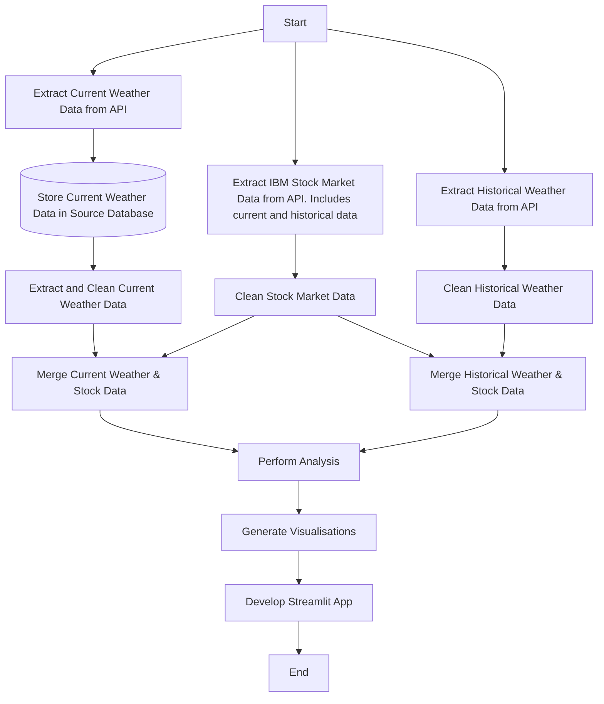

# Weather Conditions and IBM's Stock Market Movements - Project Plan

## Extraction Script Instructions

1. Please place the `.env` file attached into the root directory.
2. The extraction script `extract_to_database.py` that needs running is located in the /etl/extract directory.
3. Please navigate to the extract directory by running `cd etl/extract/` in a terminal.
4. Once there, run `python extract_to_database.py` to get the script to run.

## Chron Details

**Please run this script every hour.**

## Problem Statement

**Is there a relationship between weather conditions and IBM's stock market movements?**

### Why Investigate This?

Stock market movements are influenced by various factors. However, recent studies suggest that weather conditions may also play a role in market fluctuations. I often find myself being less productive on days when there is little to no sunshine, compared to days when there are. So, I want to know if that is also the case with the stock market, particularly focusing on IBM after a recent trip to their headquarters. With this project, I aim to explore the relationship between weather conditions and IBM's stock market trends using real-time and historical data.

## User Stories & Acceptance Criteria

### **User Story 1: Extract and Process Weather Data**

```txt
As a data engineer, I want to fetch historical and real-time weather data so that I can analyse its potential impact on IBM's stock market trends.
```

**Acceptance Criteria:**

- The system should retrieve current weather data (such as temperature, humidity, wind speed) from a Weather API.
- The system should store current weather data into a source database.
- The system should periodically run to retrieve the current weather data.

### **User Story 2: Extract and Process IBM Stock Market Data**

```txt
As a data engineer, I want to collect IBM's stock market data so that I can compare it with weather data.
```

**Acceptance Criteria:**

- The system should fetch historical and real-time IBM stock market data from a Stock Market API.
- The system should store IBM stock data in a structured format for analysis.

### **User Story 3: Data Cleaning and Preparation**

```txt
As a data engineer, I want to clean the collected data so that it is ready for analysis.
```

**Acceptance Criteria:**

- The system should handle missing or incomplete weather and IBM stock data.
- The system should standardise date and time formats.

### **User Story 4: Analyse Correlations Between Weather and IBM's Stock Movements**

```txt
As a data engineer, I want to perform analysis to determine whether weather conditions correlate with IBM's stock market movements.
```

**Acceptance Criteria:**

- The system should calculate aggregations between weather variables and IBM stock price changes.
- The system should generate visualizations to illustrate trends.
- The system should provide a summary of the findings.

### **User Story 5: Build a Streamlit App for Visualization**

```txt
As a user, I want to view interactive charts and insights on a web-based dashboard so that I can explore trends in an intuitive way.
```

**Acceptance Criteria:**

- The system should display historical IBM stock market and weather data.
- The system should allow users to filter data based on time periods and locations.
- The system should include interactive visualizations to explore correlations.

## Definition of Done

- [ ] Weather data is successfully extracted and stored in a source database.
- [ ] IBM stock market data is successfully extracted and stored in a structured format.
- [ ] Data is cleaned and formatted for analysis.
- [ ] Analysis is performed, and correlations are assessed.
- [ ] Visualizations and insights are generated in a Streamlit dashboard.

## Tools & Technologies

- **Weather API**: WeatherAPI
- **Stock Market API**: Alpha Vantage
- **Python Libraries**: Pandas, Matplotlib, Seaborn, Streamlit

## High-Level Flowchart


